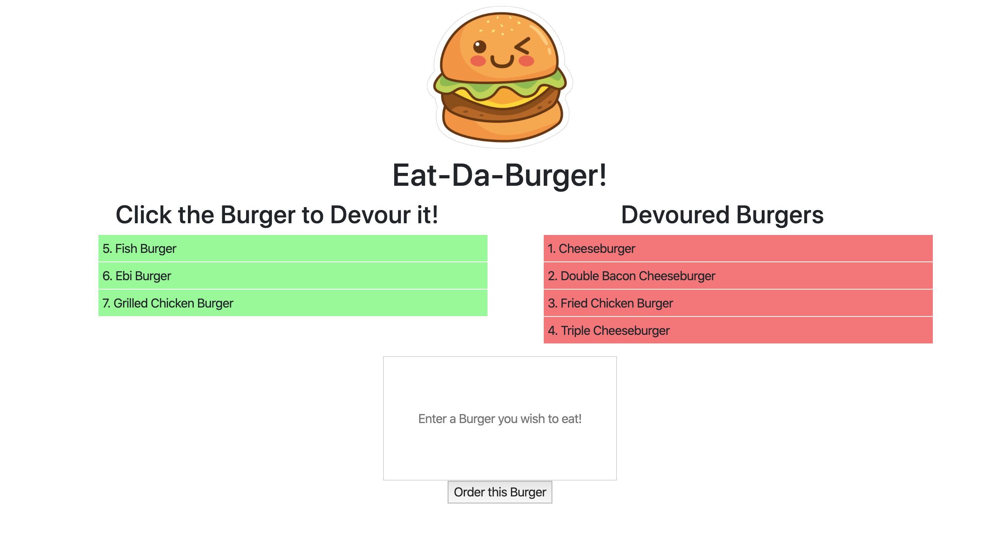

# Burger-Time

Author:
- Lam, Gerald

## Description

This is a burger logger application which is built following the MVC design pattern. The app utilises Node and MySQL to query and routes data back to the app, and Handlebars to generate it's HTML.

Please see below for the application's screenshot:

## Usage

Go to the following link: 

https://hungryburgers.herokuapp.com/

- Enter any burger to your fancy in the box with the placeholder "Enter a Burger you wish to eat!" and click "Order this Burger"
- Click the burger with green tags to 'devour' the burger
- Once the burger is 'devoured' it will appear as a red tag 

Try it out!

## Libraries and Frameworks

<b>Built with<b>

- JQuery v3.4.1
- NodeJS
- Express.js
- Bootstrap v4.0.0
- Handlebars
- CSS
- MySQL

## Roadmap

- Additional CSS styling can be added to the application
